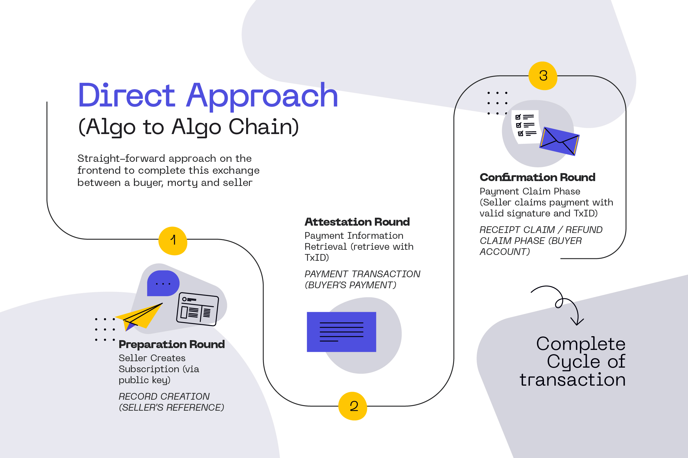
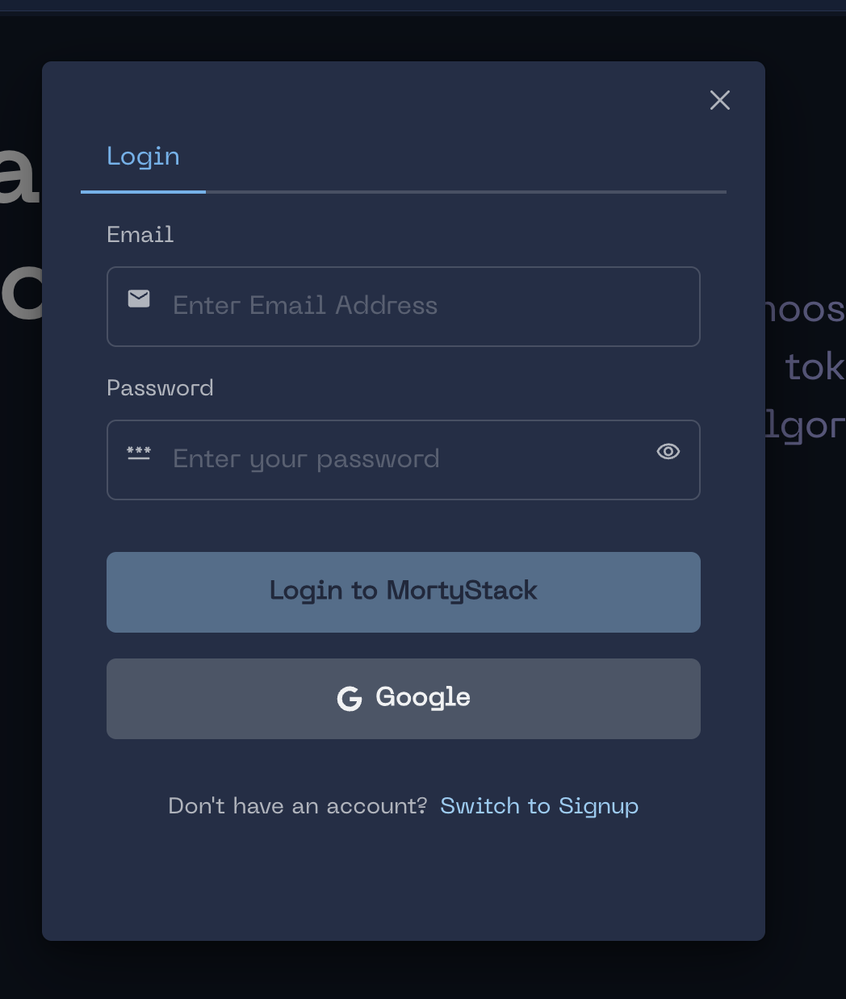
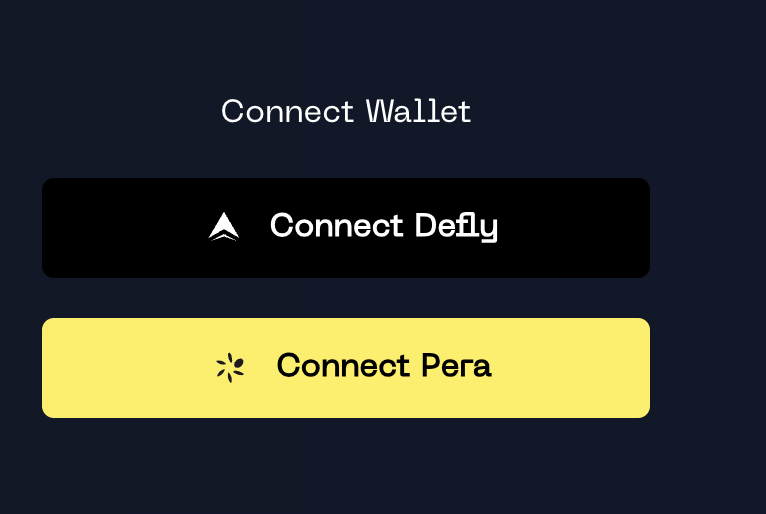
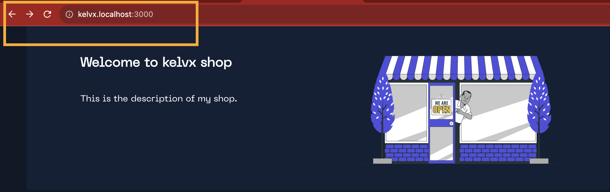
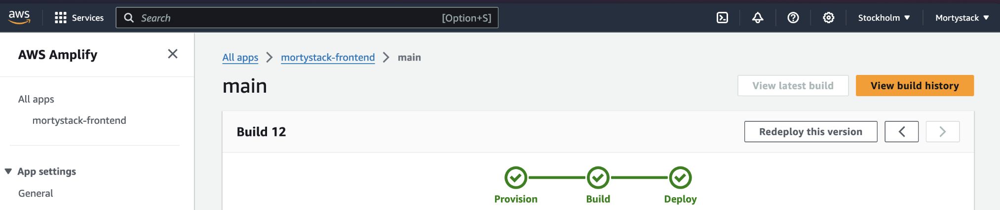

## Hello Morty fren 👋


# MortyStack wants to help millions of unsatisfied and under-banked users meet their needs and grow their businesses



### Resources

- [Pitch Deck](/MortyStack_Pitchdeck.pdf)

- [Brand Bible](/Morty_Brand_Bible.pdf)

- [Whitepaper](/MORTYSTACK_WHITEPAPER.pdf)

### Links


- [Smart Contract]("/morty-tealscript)
- [Documentation](https://docs.mortystack.xyz)
- [Dashboard](https://mortystack.xyz)

### Examples

- [SDK PayPutton Example](https://kitten-moustache.vercel.app/)

- [Invoice Sample & Checkout](https://mortystack.xyz/checkout?ref=6bH5iu8pyKmf0gF9e7a9)

- [Sample Shop](https://kelvx.mortystack.xyz/)

### Videos

- [ Demo Video (Pitch)](https://www.youtube.com/watch?v=sq3tRW7CJEQ)
- [ Demo Video (Design)](https://www.loom.com/share/96ec49ee09a945a6b10e980995722a6d?sid=0651864d-8cbd-460d-b1ac-8b7139feeefc)
- [ Demo Video (Whitepaper)]()
- [ Demo Video (Smart Contracts)]()
- [ Demo Video (Client)]()

### Contributors

[Contributors](TEAM.md)

## Testing MortStack Contracts

clone the repository

```
git clone https://github.com/acgodson/mortystack
```

open the tealscript directory and run the test

```
cd morty-tealscript
npm install
npm test
```

## Using the MortyStack SDK & Dashboard

To use enable morty within your React app, you will need to install [mortystack](https://www.npmjs.com/package/mortystack) and fill in your organization's ID obtained from the [dashboard]().

```javascript
npm i mortystack

```

- Usage

```javascript
import { usePay, MortyStackProvider, PayButton } from "mortystack";
```

### App Configuration

- Initialize assets and get asset IDs:

```javascript
const { initAssets, ASSET_IDS } = usePay();

const selectedAssets = initAssets([
  ASSET_IDS.WETH,
  { id: 10458941, symbol: "USDC" }, // custom asset
  ASSET_IDS.ALGOS,
  ASSET_IDS.WMATIC,
]);
```

- Configure and wrap your app/desired componet with the Mortystack provider :

```javascript
const config = {
  id: "HIG-1699996617305-FY1K59", // Morty Organization ID from your Dashboard
  assets: selectedAssets,
  signer: {
    addr: //HSDGESxxxxTYRJ, // address that owns and signs the record,
    secret?: process.env.Secret // dispenser secret if available
  }
}
    <MortyStackProvider config={config}>
        <Component {...pageProps} />
 </MortyStackProvider>

```

### Retreiving your App ID

1.  Login to the [MortStack Dashboard](https://mortystack.xyz). We use `Web3Auth` and `jwt` to generate a unique account address for each email login.



2. Connect an External provider to your dashboard. We use useWallet from `@txnlabs`



3. Create a new Subscription

4. Now you create a new organization and open a new record on chain

5. Copy the Organization ID afterwards

# With your Organization ID, you can now

**- 1. Create quick `Invoices` and forward checkout links to customers. See example [invoice](https://mortystack.xyz/checkout?ref=6bH5iu8pyKmf0gF9e7a9)**

**- 2. Set up the `mortystack Button` to receive assets originating from your website. See example [website](https://kitten-moustache.vercel.app/)**


```javascript
import { PayButton } from "mortystack";

// The PayButton triggers the payment modal onclick
```

- Add payload from your application states

```javascript
const [payload, setPayload] = useState()

<PayButton
  payload={{
    asset: asset,
    amount: amount,
    email: undefined,
    name: undefined,
    items: undefined,
    acceptWrapped: true,
  }}
/>
```

| Prop          | Type                     |               Description               |
| :------------ | :----------------------- | :-------------------------------------: |
| asset         | number                   |                Asset ID                 |
| amount        | number                   |               amount in $               |
| email         | string, optional         |            customer's email             |
| name          | string, optional         |             customer's name             |
| items         | InvoiceItems[], optional |              invoice items              |
| acceptWrapped | boolean, optional        | accept wrapped tokens (wormhole bridge) |

**- 3. Host a shop for your organization with your choice sub-domain example `[name].mortystack.xyz`, served from `AWS Amplify`**





### Appendix

Monorepo Structure

- Docs
- Frontend
  - API
  - Shops
  - Pay
  - Checkout
  - Dashboard
- Smart Contract
  - Test
- SDK
  - Example Project
  - Packages

`Code Refactoring in progress`
